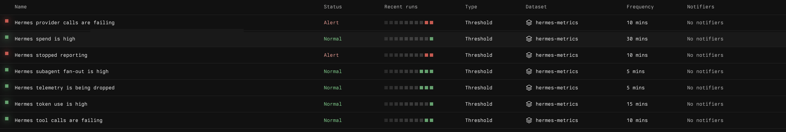
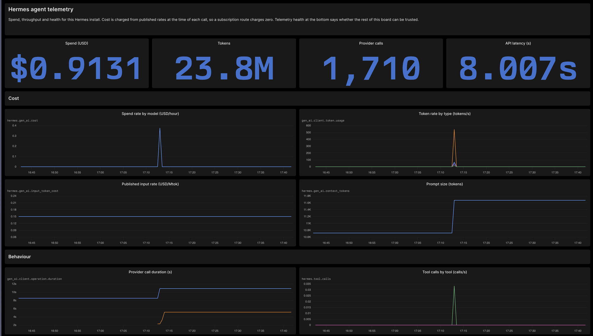

# hermess-metrics

Ships [Hermes](https://hermes-agent.nousresearch.com) agent telemetry to
[Axiom](https://axiom.co) as OpenTelemetry traces, metrics and logs. Spend per
model, token burn, tool and provider failures, and whether the agent is stuck in
a loop.

## Alerts



## Dashboard



## Quickstart

Install it into the same Python that runs `hermes`, enable it, and answer one
question:

```sh
pip install 'hermess-metrics[otlp] @ git+https://github.com/axiomhq/hermess-metrics'
hermes plugins enable hermess-metrics
hermes axiom setup
hermes axiom alerts        # optional, adds the monitors above
```

Setup asks where telemetry should go. Choose **1** and it provisions a fresh
Axiom org in seconds, creates the three datasets, mints a token that can only
write to them, and prints a claim link. Follow that link within a day or the org
and everything in it is deleted. Choose **2** to use an Axiom org you already
have, with a token holding `datasets:create`. Either way it writes the settings
and you are done; `hermes axiom status` confirms it, and `hermes axiom alerts`
adds the seven monitors pictured above.

## What you get

**Metrics.** Spend in dollars charged from published rates at call time, tokens
split across input, output, cache read, cache write and reasoning, provider and
tool latency, turn shape, session outcomes, subagent fan-out, and the installed
tool and skill inventories with per-item call counts that read zero rather than
going missing. Plus the plugin's own queue accounting, so a quiet dashboard is
never ambiguous.

**Traces.** Sessions, turns, provider calls and tool executions as one trace,
using Axiom's generative AI conventions so it lights up in the AI views.

**Logs.** Failed provider and tool calls only, so the dataset stays a failure
feed rather than a duplicate of the traces.

## Configuration

Settings live in `~/.hermes/.env`, which Hermes loads at startup. `hermes axiom
setup` writes them for you; set them by hand only if you want to.

| Variable                             | Purpose                                       |
| ------------------------------------ | --------------------------------------------- |
| HERMES_AXIOM_TOKEN                   | Axiom API token with ingest rights            |
| HERMES_AXIOM_DOMAIN                  | Deployment host, default `api.axiom.co`       |
| HERMES_AXIOM_TRACES_DATASET          | Dataset receiving traces                      |
| HERMES_AXIOM_LOGS_DATASET            | Dataset receiving logs                        |
| HERMES_AXIOM_METRICS_DATASET         | Dataset receiving metrics                     |
| HERMES_AXIOM_REDACTION               | `metadata`, `tools` or `full`, default first  |
| HERMES_AXIOM_SERVICE_NAME            | Service name on every signal, default `hermes` |
| HERMES_AXIOM_METRIC_INTERVAL_SECONDS | Export cadence, default 30                    |
| HERMES_AXIOM_QUEUE_CAPACITY          | Events buffered before dropping, default 2048 |
| HERMES_AXIOM_MAX_CHARS               | Cap on any captured string, default 12000     |
| HERMES_AXIOM_CONTAINER_STATS         | Sample Docker sandboxes, default off          |
| HERMES_AXIOM_DEBUG                   | Verbose plugin logging                        |

One signal is enough; set only the datasets you want.

### Redaction

Hermes hook payloads carry prompts, conversation history, tool arguments and
tool results, and may contain secrets. `metadata` ships identifiers, models,
token counts, durations and error classes, and no content. `tools` adds tool
arguments and results. `full` adds prompts and model output. Credentials are
masked and strings are capped at every level, so raising the level widens what
you can see without widening what leaks.

## How it behaves

Hermes dispatches its observer hooks inline on the thread running your turn, so
everything here is handed to a background worker and the hook returns
immediately. The queue is bounded and drops rather than blocks; the drop count
is itself a metric. A missing dependency, an unreachable Axiom or a change in
the hook payload schema all degrade to a warning and a working agent.

## Licence

Dual licensed under either of Apache License 2.0 or MIT, at your option.
See `LICENSE-APACHE` and `LICENSE-MIT`.
